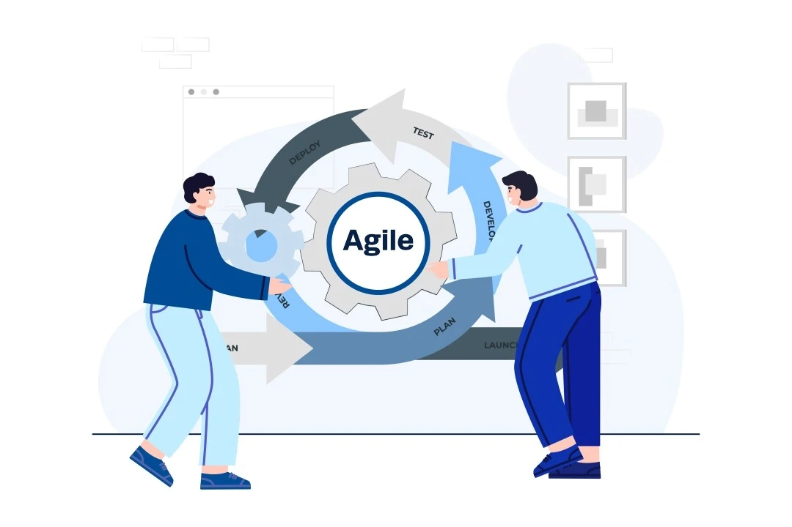
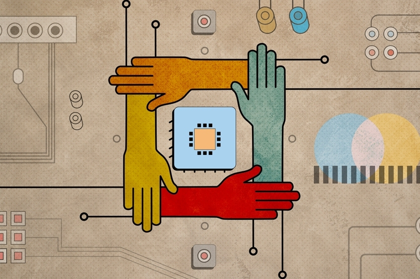

# A Different Perspective on Software Engineering

Throughout this course, I learned that software engineering is much more than just building web applications. Even though we spent most of the semester developing web-based assignments and projects, the class also taught important concepts that apply to many different areas in technology. Before this course, I mostly thought software development was just about coding, but now I understand that software engineering also involves teamwork and responsibility. Two topics that stood out to me the most were Agile Project Management and Ethics in Software Engineering because they both showed how software development goes beyond simply writing code.

# Agile Project Management

One of the biggest concepts I learned in this class was Agile Project Management. Agile is a project management approach where teams break projects into smaller tasks, continuously improve their work, and adapt to changes throughout development instead of following one strict plan from start to finish. In this course, we used a style called Issue Driven Project Management (IDPM), where project tasks and problems were organized into “issues” on GitHub that could be assigned to team members and tracked through milestones during the final project. What made this interesting to me was that I had already used similar Agile practices during my internship last summer as a project management intern. In that role, we used a Microsoft Planner board with different buckets to organize and track tasks across projects. Even though that internship did not involve programming, the workflow felt very similar to what we did in this class with GitHub. It was cool seeing how the same ideas could be applied both in project management and software engineering. This helped me realize that Agile is not just useful for web development, but for many different kinds of projects that require teamwork, communication, and organization.

# Ethics in Software Engineering

Another important topic I learned about was Ethics in Software Engineering. Ethics in software engineering refers to the moral and professional responsibilities technology professionals have when working with software, systems, and user information. Since technology impacts so many people, software engineers need to think ethically about privacy, security, and how their work affects others. This topic connected a lot to my own internship experience. On the IT side of my internship, I had to set up and troubleshoot devices and complete a mail migration, which involved transferring user email data and account information between systems. Because of that, I sometimes had access to sensitive information like passwords, emails, files, and other work-related data. That experience showed me how important trust and responsibility are in technology-related careers. Just because someone has access to information does not mean they should misuse it. Learning about ethics in this course reinforced the idea that software engineering is not only about technical skills, but also about acting professionally and protecting user privacy. This is especially important in cybersecurity where professionals are trusted with sensitive systems and information every day.

# Looking Ahead

Overall, this course changed the way I think about software engineering. I came into the class expecting to mainly learn web development, but in addition, I also ended up learning a lot about how software projects are managed and the responsibilities engineers have when creating technology. These concepts go far beyond web application development and it will definitely be useful in my future career in computer science and cybersecurity.