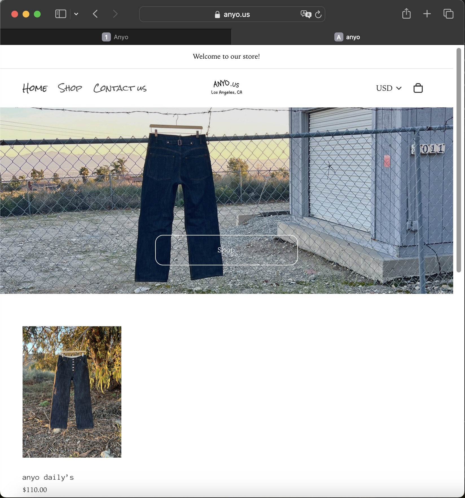
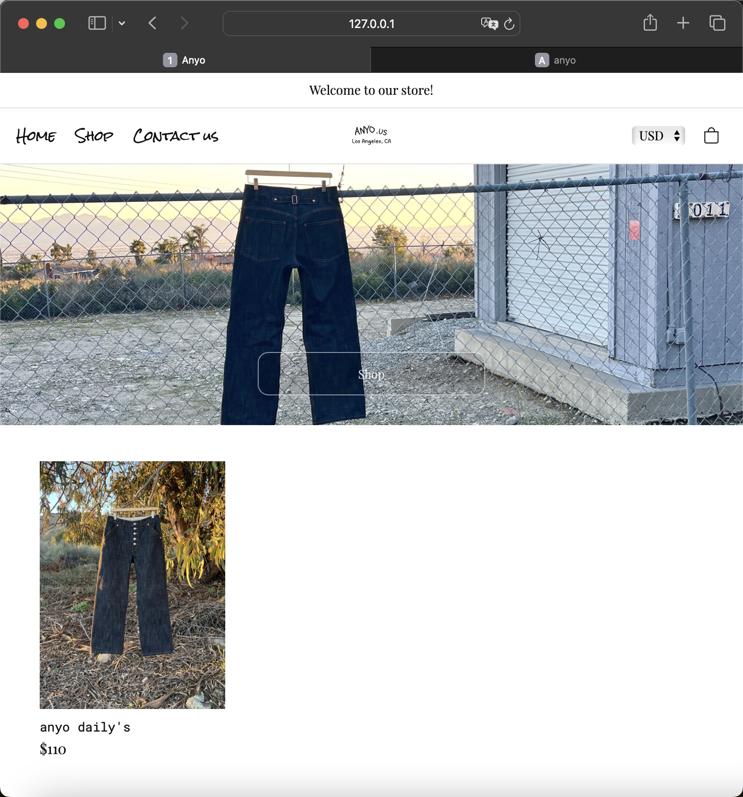

## Is Bootstrap Even Worth Learning?

Getting into Bootstrap 5 is easy to get lost in, kind of like following a slithering snake. You already put in all this time learning HTML and CSS, and now there's a whole new set of class names you're supposed to know on top of that. To be honest, I am not even close to memorizing the different classes. It honestly feels like picking up a new language just to avoid writing a few extra lines of CSS. There's just a lot going on with it and it takes a while before anything really starts to make sense.

## Time is Money
The biggest thing I noticed once I started getting the hang of it is how much more you can actually do. With pure HTML we could only really make simple navbars and basic buttons, but with Bootstrap you can just list a jumble of classes and achieve your desired look without having to write a ton of extra code yourself. That kind of convenience adds up fast, especially when you have a whole project to build and not just one page. And it's not just beginners using it either. Companies like Spotify and Twitter have used Bootstrap to build parts of their sites, so clearly it's good enough for the big leagues.

## Less Code, Less Problems
I still have mixed feelings about Bootstrap. Sometimes it feels like I'm copying class names without really knowing what they do, which is a little sketchy. But using pre-built classes instead of hardcoding everything from scratch means a lot less room for error. When you hardcode the same feature over and over across different pages, something is bound to break eventually. Bootstrap keeps things consistent so you're not debugging the same thing five times. I was honestly proud to step into a new zone of web development and be able to recreate my friend's clothing brand website using Bootstrap features and CSS styling.

  

    
  

  

    
  

Left: my friend's actual site. Right: what I was able to recreate using Bootstrap.
