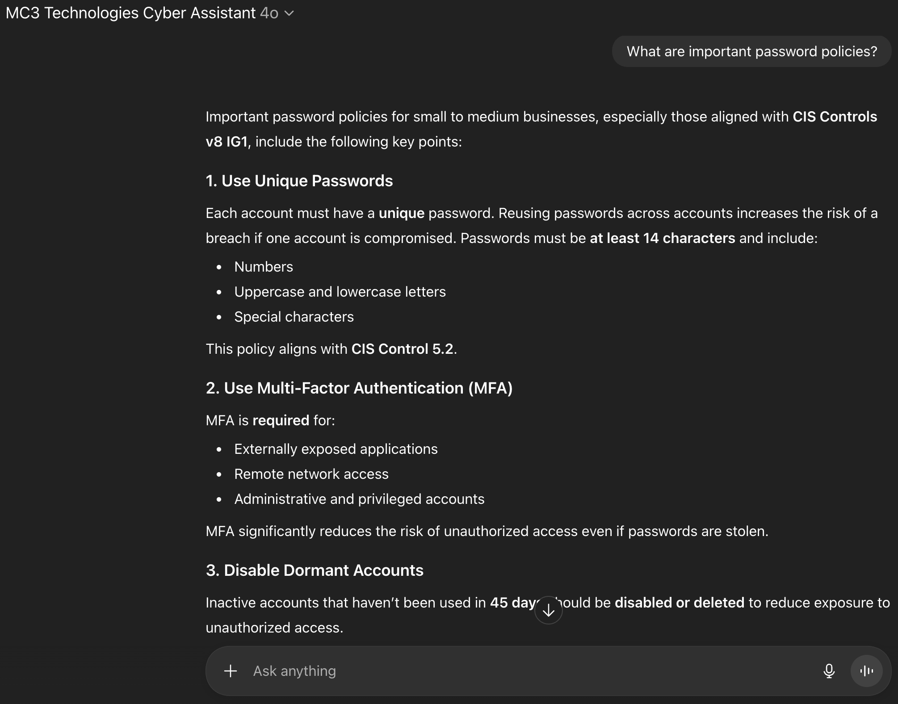

I worked alongside a teammate to build a custom GPT compliance assistant for MC3 Technologies and it was integrated into the company’s Governance, Risk, and Compliance (GRC) website. The assistant was documented and prompt-trained on CMMC IG1 standards to give small and medium-sized businesses (SMBs) quick and easily accessible assistance to their cyber needs.

For many SMBs, becoming CMMC Level 1 compliant helps ensure they meet basic cybersecurity expectations when working with the Department of Defense.

### What it does
- Translates CMMC IG1 requirements into plain-language explanations and actionable next steps.
- Helps users draft and refine policy language, procedures, and evidence checklists aligned to common assessment expectations.
- Provides implementation tips and examples tailored to typical SMB environments.

### Example output format

<pre>
User: "What do I need for access control at IG1?"

Assistant:
1) What the requirement means (plain language)
2) What to implement (practical steps)
3) What evidence to collect (audit-ready artifacts)
4) Common pitfalls (what assessors flag)
5) Quick checklist (copy/paste)
</pre>

Source: <a href="https://chatgpt.com/g/g-iqywRe9sH-mc3-technologies-cyber-assistant" target="_blank"><i class="large link icon"></i>View the Custom GPT</a>