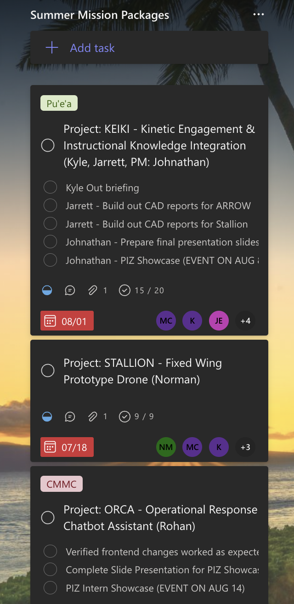
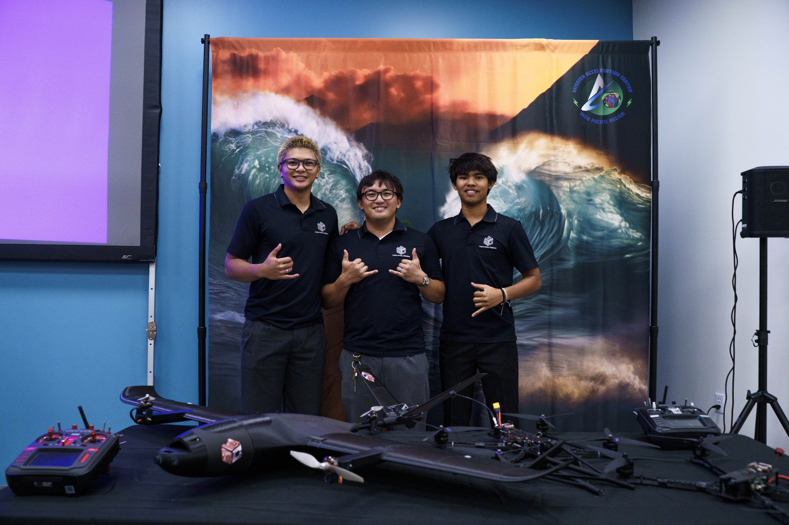

During MC3 Technologies’ summer intern cohort, I supported **project coordination for a drone initiative** by organizing deliverables in MS Planner and collaborating with the team through daily Zoom Scrum check-ins.

### Example project tracking

  <!-- Left: Image with note underneath -->
  

    
    

      Note: This screenshot shows an example of an MS Planner task bucket, where project deliverables were organized into task lists with subtasks and progress tracking.
    

  

  <!-- Right: Project details -->
  

    <h3>What it involved</h3>
    <ul>
      <li>Managing task assignments and subtasks using MS Planner buckets</li>
      <li>Supporting sprint planning and daily team communication</li>
      <li>Relaying updates between the intern team and MC3 administrators to support clear project alignment</li>
      <li>Helping the intern team stay aligned on priorities and milestones</li>
    </ul>

    <h3>Impact</h3>
    <ul>
      <li>Improved visibility and organization of project progress across the remote intern team</li>
    </ul>
  

<!-- Intern team collaboration photo -->

  

Source: MC3 Summer Intern Cohort Project 
Slides: <a href="https://www.canva.com/design/DAGu3veJXpQ/kMc8PTq8W9D3hqZwUCkPHg/view?utm_content=DAGu3veJXpQ&utm_campaign=designshare&utm_medium=link2&utm_source=uniquelinks&utlId=h02e9c3279e" target="_blank"><i class="large link icon"></i>View Slides</a>